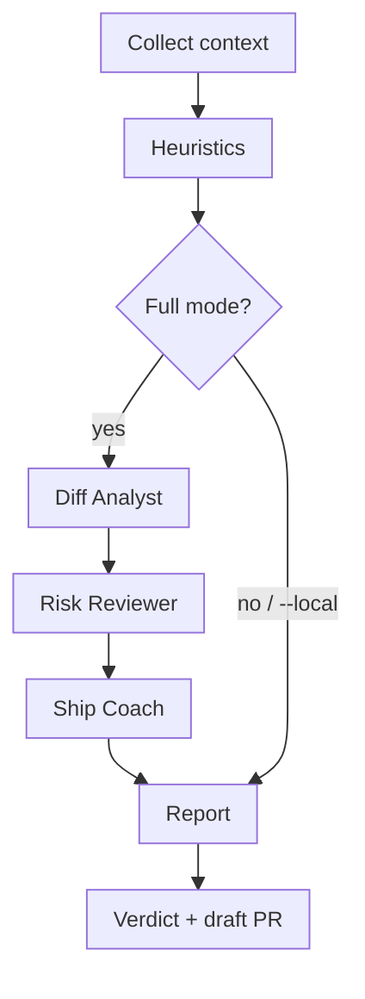

import Tooltip from '@/components/Tooltip.astro';

Architecture is pipes-and-filters. Heuristics catch obvious issues in seconds; full mode still runs AI so Ship Coach can merge local and model findings.

## Stages

1. **Context** — diff, changed files, optional test signals, Spec task counts, root `ready.yml` (`git` or `--path`)
2. **Heuristics** — secrets (`.env`, `AKIA` / `ghp_` patterns), TODO/FIXME, debug logs, custom regex from <Tooltip term="readyyml" label="ready.yml" />
3. **Diff Analyst** — summarizes the change set
4. **Risk Reviewer** — scores risks and blockers
5. **Ship Coach** — merges findings into <Tooltip term="verdict" label="READY / READY WITH WARNINGS / NOT READY" />, checklist, draft PR title/body, top actions

## Graceful degradation

On agent failure or missing Bedrock access, the product degrades to a heuristic-only report rather than failing the API hard — especially important for GitHub Actions (prefer HTTP 200 with a degraded report).

:::tip
Heuristic blockers do **not** skip AI in full mode. Ship Coach merges local and model findings so the verdict stays consistent across surfaces.
:::

## Timeouts

Sequential Bedrock calls default to ~20s each. Lambda budget is ≥90s / 512 MB. Save-path Kiro hooks stay on heuristics (30s); full Bedrock is user-triggered (120s).
